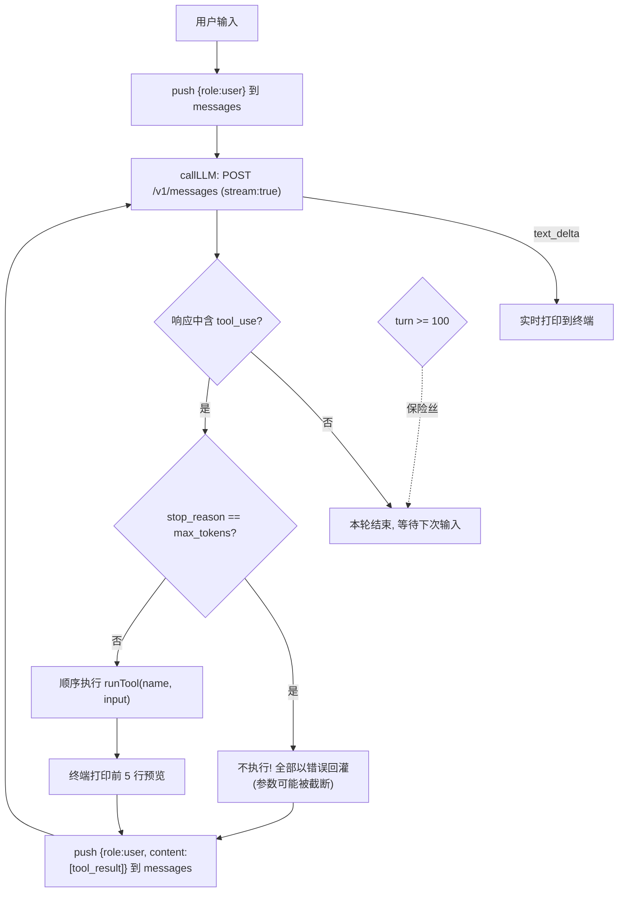
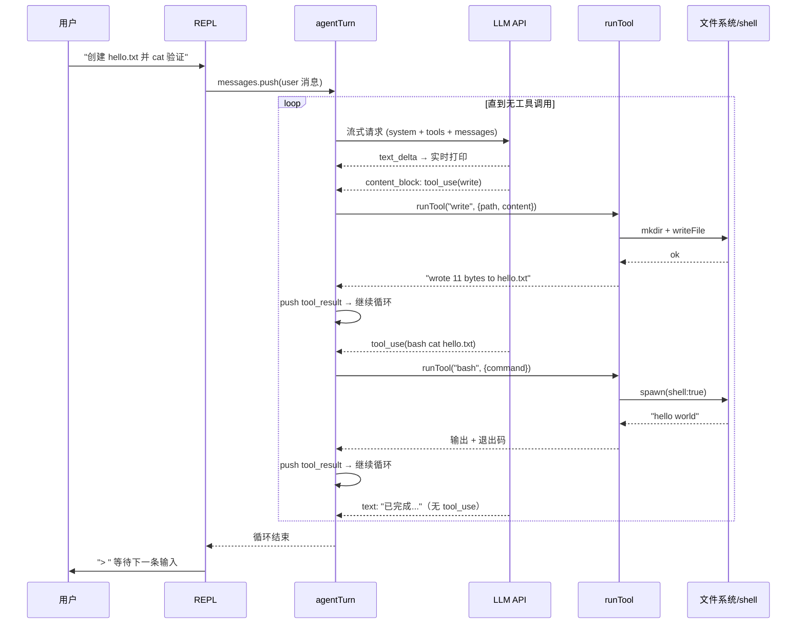

# ti 架构文档

> **注意**：本文档记录的是 v0.1 单文件版（`agent.ts`，已删除）的架构。
> 当前实现已按 `docs/DESIGN.md` §2 拆分为 `src/` 四层模块化结构（行为不变）；
> 分层思想不变，本文将在 v1.0 里程碑按新结构重写。

单文件极简 coding agent，架构参考 [pi](https://github.com/badlogic/pi-mono)（现 earendil-works/pi）。
零 npm 依赖，Node ≥ 22.18 直接运行。

## 总体分层

```
┌────────────────────────────────────────────────────────────────────┐
│                              agent.ts                              │
│                                                                    │
│  配置层    CLI > ~/.ti/settings.json > 预设（不采用 env 值）         │
│              resolveProvider() → { protocol, baseURL, model, key } │
│              预设：deepseek(默认 flash，含 pro) / anthropic         │
│                                                                    │
│  交互层    REPL (readline 异步迭代)                                 │
│                             │                                      │
│                             ▼                                      │
│  循环层    agentTurn(messages)   ←—— 唯一状态：messages[] 数组      │
│              │  流式请求 → 执行工具 → 结果回灌 → 循环               │
│              ▼                                                     │
│  传输层    callLLM() 协议分发 ── 共用 sseJson() SSE 帧解析          │
│              ├─ callAnthropic() ─▶ /v1/messages (官方/Kimi 等)     │
│              └─ callOpenAI()    ─▶ /chat/completions (DeepSeek 等) │
│                   收发边界做格式转换，内部统一为 Block[]             │
│              │  onText 增量回调 ───────────────▶ stdout 实时显示    │
│              ▼                                                     │
│  工具层    runTool(name, input)                                    │
│              ├─ read   带行号读文件（offset/limit 分页）            │
│              ├─ write  创建/覆盖文件（自动建父目录）                │
│              ├─ edit   精确替换（oldText 唯一性校验）               │
│              └─ bash   shell 执行（超时/截断/退出码）               │
└──────────────────────────────┬─────────────────────────────────────┘
                               ▼
                     本地文件系统 / 系统 shell
```

## 核心：agent 主循环

整个 agent 的**唯一状态是 `messages` 数组**（对话历史）。每轮用户输入触发如下循环，
直到模型响应中不再包含工具调用：



## 一次典型请求的时序



## 状态演化示例（messages 数组）

`messages` 是唯一状态，也是发送给 API 的完整上下文。一次「写文件并验证」后：

```jsonc
[
  { "role": "user", "content": "创建 hello.txt 并 cat 验证" },
  { "role": "assistant", "content": [
      { "type": "tool_use", "id": "toolu_1", "name": "write",
        "input": { "path": "hello.txt", "content": "hello world" } }
  ]},
  { "role": "user", "content": [
      { "type": "tool_result", "tool_use_id": "toolu_1", "content": "wrote 11 bytes..." }
  ]},
  { "role": "assistant", "content": [
      { "type": "tool_use", "id": "toolu_2", "name": "bash", "input": { "command": "cat hello.txt" } }
  ]},
  { "role": "user", "content": [
      { "type": "tool_result", "tool_use_id": "toolu_2", "content": "hello world" }
  ]},
  { "role": "assistant", "content": [
      { "type": "text", "text": "已完成：hello.txt 内容为 hello world" }
  ]}  // 无 tool_use → 循环结束
]
```

要点：tool_result 以 `role:"user"` 消息回灌（Anthropic 协议约定）；`tool_use_id`
把结果关联回对应的调用；`is_error:true` 让模型知道失败并自我纠正。

## agent.ts 区块 ↔ pi 源码对应关系

| agent.ts 区块 | pi 源码位置 | 简化说明 |
|---|---|---|
| `agentTurn()` | `packages/agent/src/agent-loop.ts` | pi 还有 steering 消息、并行/顺序双模式、事件总线；这里只保留顺序执行主干 |
| `TOOLS` + `runTool()` | `packages/coding-agent/src/core/tools/{read,write,edit,bash}.ts` | 参数 schema 与描述逐一对齐；去掉 TUI 渲染与可插拔 operations |
| `truncate()` | `core/tools/truncate.ts` | 同样的头部截断：2000 行 / 50KB |
| `buildSystemPrompt()` | `core/system-prompt.ts` | 同样 <1k tokens；同样加载 AGENTS.md/CLAUDE.md 作为 project_context |
| `callLLM()` → `callAnthropic()` / `callOpenAI()` | `packages/ai`（多 provider 统一流式层） | 双协议（Anthropic Messages / OpenAI chat completions），收发边界做格式转换、内部统一 `Block[]`，共用 `sseJson()` 帧解析 |
| `resolveProvider()` + `~/.ti/settings.json` | `~/.pi/agent/`（settings.json + auth.json + models.json） | CLI > 配置文件 > 预设；不采用环境变量的值 |
| `repl()` | `packages/tui` + modes/interactive | pi 是完整 TUI（差分渲染、编辑器组件）；这里是 readline + `/model` `/clear` 斜杠命令 |

## 关键保护机制

| 机制 | 位置 | 作用 |
|---|---|---|
| max_tokens 保护 | `agentTurn()` | 被截断响应中的工具调用不执行，报错回灌让模型重发完整调用 |
| edit 全量预校验 | `runTool()` edit 分支 | 所有 oldText 先在原文件校验唯一性，全部通过才应用，杜绝半成品文件 |
| 错误回灌 | `agentTurn()` | 工具异常 → `is_error:true` 的 tool_result，模型据此自愈而非崩溃 |
| MAX_TURNS=100 | `agentTurn()` | 死循环保险丝 |
| 输出截断 | `truncate()` | 防止大文件/长跑命令输出撑爆上下文 |
| readline 异步迭代 | `repl()` | 管道输入不丢行、不抛 `ERR_USE_AFTER_CLOSE` |

## 有意省略（pi 有、本项目超出行数预算）

扩展系统、skills、MCP、权限弹窗、plan mode、子 agent、session 持久化、
thinking 块、并行工具执行、TUI。
