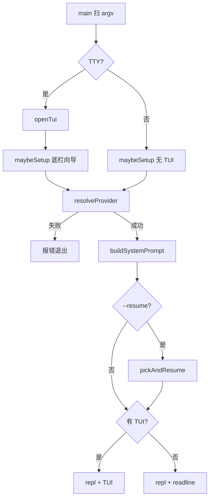
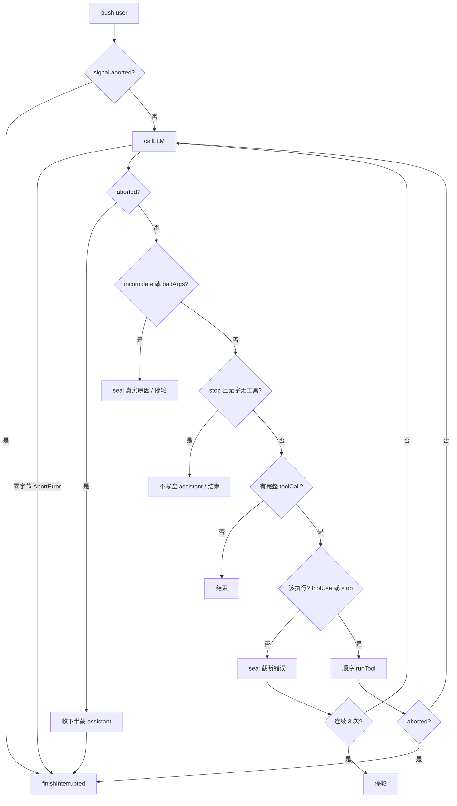

# ti 架构文档

当前实现（`src/` 四层）。需求与未做项以 `docs/PRD.md`、`docs/DESIGN.md` 为准。

零运行时依赖。开发：`npm start` 直接跑 TypeScript。发布：`scripts/build.mjs` 打成 `bin/ti.js`。

## 总体分层

接口层（`cli/`）→ 应用层（`core/`）→ 适配层（`llm/` `tools/` `config/`）。依赖由外向内；`main.ts` 是唯一装配点。

```
┌────────────────────────────────────────────────────────────────────┐
│  main.ts   扫 argv → TTY 则 openTui → maybeSetup → setProvider → [--resume] → repl │
│                                                                    │
│  配置    CATALOG + ~/.ti/settings.json                             │
│            CLI > 文件里写了的字段 > 目录托底（不读 env 值）           │
│            --provider 失败即退出，不回退、不丢给向导                  │
│                                                                    │
│  交互    TTY：TUI（底栏编辑、斜杠列表、setup 向导）                   │
│          非 TTY：readline 管道 REPL                                 │
│                             │                                      │
│                             ▼                                      │
│  循环    agentTurn(messages)   状态就是 messages[]                  │
│            进出数组一律 pushMessage / popMessage（顺手落盘）         │
│            流式请求 → 完整 toolCall 才执行 → 结果回灌 → 循环         │
│            AbortSignal 贯穿 fetch 与 bash；中断走 finishInterrupted │
│              ▼                                                     │
│  传输    callLLM() ── sseJson()                                    │
│            ├─ Anthropic  /v1/messages                              │
│            └─ OpenAI     /chat/completions                         │
│            收发边界翻译；内部是 types.ts 的 Message 联合              │
│              ▼                                                     │
│  工具    runTool()                                                 │
│            read / write / edit / bash                              │
└──────────────────────────────┬─────────────────────────────────────┘
                               ▼
                     本地文件系统 / 系统 shell
```

## 源码树

```
src/
  main.ts            入口：参数、向导、装配
  types.ts           内部消息与 ProviderConf（纯类型）
  cli/
    tui.ts           TTY 主屏
    repl.ts          斜杠命令与一轮调度
    render.ts        颜色、工具摘要、AgentUI
    keys.ts          按键名、CSI/SS3 拼键
    form.ts          全屏 select/input（非 TUI 兜底）
    setup.ts         配置向导
  core/
    agent.ts         agentTurn
    session.ts       当前目录 jsonl、pushMessage、list / resume / rename
    prompt.ts        系统提示词（AGENTS.md / CLAUDE.md）
  llm/
    index.ts         协议分发
    sse.ts           SSE 帧
    anthropic.ts     Messages 协议
    openai.ts        chat/completions 兼容
  tools/
    index.ts         TOOLS + runTool
    read.ts / write.ts / edit.ts / bash.ts
    truncate.ts      2000 行 / 50KB
  config/
    index.ts         CATALOG、settings、resolveProvider
```

尚未落地（见 DESIGN.md）：`skills.ts`、`paths.ts`、历史落盘、冒烟测试。`permissions.ts`、`cli/input.ts` 是权限确认的设计稿，产品已决定不做。

## 启动



- `ti setup`：强制向导。取消时，本来就能用则退出码 0，否则 1
- `--provider name`：只解析这个名字；失败退出，不回退 `settings.provider`
- `-m / --model`：只影响本进程，不写回 settings
- `--resume`：setup 与 provider 定完之后挑当前目录的一份会话；取消或没有则新开，不退出。不切厂家

## 核心：agent 主循环

唯一对话状态是 `messages[]`，进出都走 `pushMessage` / `popMessage`（内存 + `<cwd>/.ti/sessions/*.jsonl`）。每轮用户输入触发循环，直到模型不再给出可执行的工具调用、流失败、中断或超过 `MAX_TURNS`（100）。



**中断收尾** `finishInterrupted`（屏幕只打一次 `[interrupted]`）：

- 栈尾有未配 toolCall：只 `sealTools("Error: aborted by user")`，不再追加 interrupted user（否则下一轮协议 400）
- 否则：留下已有内容，再 `push user("[interrupted]")`

**流失败**：`stopReason` 未收到线上结束原因 → `incomplete`；说完或正式 tool 结束但参数解不开 → `badArgs`。这两种不跑半截工具，seal 后停轮。

**截断**：`length` 不执行工具；补错误结果再让模型重发，连续 3 次停轮。

工具失败转成 `isError` 的 `toolResult` 回灌，loop 不崩。

## 内部消息

协议线格式只在 `llm/` 翻译。内存里是：

```jsonc
[
  { "role": "user", "content": "创建 hello.txt 并 cat 验证" },
  { "role": "assistant", "content": [
      { "type": "toolCall", "id": "call_1", "name": "write",
        "arguments": { "path": "hello.txt", "content": "hello world" } }
    ], "stopReason": "toolUse", "usage": { "input": 100, "output": 40 } },
  { "role": "toolResult", "toolCallId": "call_1", "toolName": "write",
    "content": "wrote 11 bytes to hello.txt", "isError": false },
  { "role": "assistant", "content": [
      { "type": "text", "text": "已完成" }
    ], "stopReason": "stop", "usage": { "input": 160, "output": 20 } }
]
```

Anthropic `toWire`：连续 `toolResult` 归并成一条 user；相邻 user 合成一条（角色必须交替）。OpenAI `toWire`：`toolResult` 1:1 成 `role:"tool"`；system 单独一条。

## 配置

`CATALOG` 写死 deepseek / kimi / glm 的协议与地址。setup 给这三家只写 `apiKey` 与模型，不写 protocol/baseURL。

`~/.ti/settings.json`：`saveSettings` 目录 `0o700`、文件 `0o600`（chmod 失败忽略）。不读环境变量的值。

`listProviderNames()` 只列能 `resolveProvider` 的（没 key 的不出现）。`/model` 只切已写入的模型 id。

## 交互

**TUI**（TTY）：底栏常开。`/` 出命令列表，`/model` `/provider` 二级。Enter 在模型忙碌时进队列，等本轮结束再发。Ctrl+C：有字清空 → 向导取消 → busy 打断 → 空闲退出。Esc：向导取消 → 二级往回退 → busy 打断（不丢队列）→ 清空。没有 Ctrl+D。重绘：行级 diff + CSI 2026。

**readline**（非 TTY）：`> ` 提示，斜杠命令同一套 `dispatch`。没有 AbortController，空闲 Ctrl+C 随 readline 结束。

斜杠：`/clear` `/resume` `/rename` `/model` `/provider` `/setup` `/cost` `/help` `/exit`。未知 `/xxx` 不当用户消息发给模型。会话按项目落在 `<cwd>/.ti/sessions/`，`--resume` 与 `/resume` 共用 `pickAndResume()`。

## 关键保护

| 机制 | 位置 | 作用 |
|---|---|---|
| 流失败停轮 | `agentTurn` | `incomplete` / `badArgs` 不跑半截工具 |
| max_tokens | `agentTurn` | `length` 不执行，seal 后最多再试 3 次 |
| 中断收尾 | `finishInterrupted` | 未配 toolCall 先补结果，协议合法 |
| bash 可杀 | `bash.ts` | abort → SIGTERM，2s 后 SIGKILL |
| edit 原文定位 | `edit.ts` | 多条对着同一份原文 `indexOf`，区间不重叠，倒序写回 |
| MAX_TURNS=100 | `agentTurn` | 死循环保险丝 |
| 输出截断 | `truncate` | 2000 行 / 50KB |
| `--provider` | `main.ts` | 名字不对或缺 key 直接退出 |

## 有意未做

`-c` / `--continue`、`/compact`、skills、历史落盘、冒烟测试、权限确认、MCP、子 agent、plan mode、扩展系统。TUI 也还没有真追加滚动、steering、括号粘贴。
